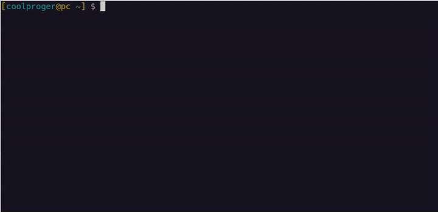

# Basic usage



## Startup
There are 2 ways you can run `vibe`

1. Just a regular start: 
    ```
    vibe
    ```
2. Start with a file
    ```
    vibe file.ext
    ```

In second case you will select file `file.ext` and you will see its name in prompt:
> gpt-4o-mini@file.ext>

It means that LLM will be told that you are working on this particular file,
so it will know where to write code.

## Send a message

As you started `vibe` you can begin prompting.
You can input one line of text, then it will be sent do LLM.
You will be notified if agent performs some actions, like file reading or directory listing.

If model wants to write a file, you will be asked to give consent.

## Change a file
When you need to switch to another file, you can type `@filename` to switch to `filename`.
```
gpt-4o-mini@file.ext>@filename
gpt-4o-mini@filename>
```
Next new request will contain this new filename.

In case you want to close a file (not to distract LLM with this specific file) just type `@` without any parameters.
You will see how filename disappears from command line prompt:
```
gpt-4o-mini@file.ext>@
gpt-4o-mini>
```
